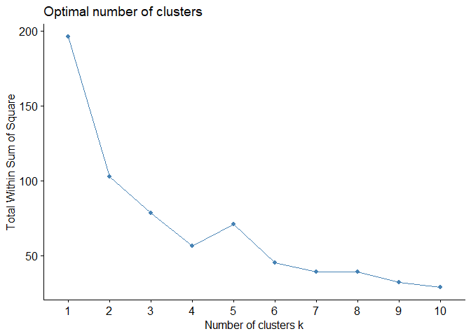
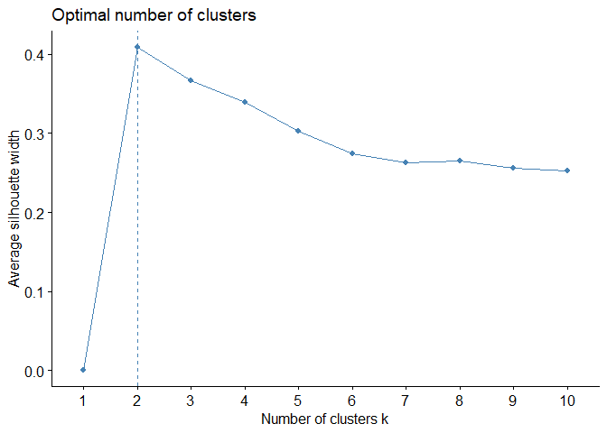
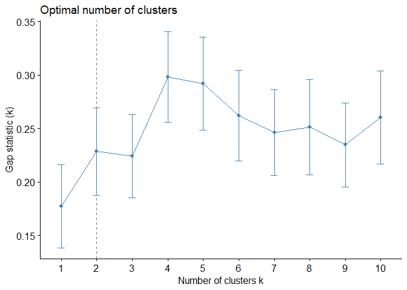
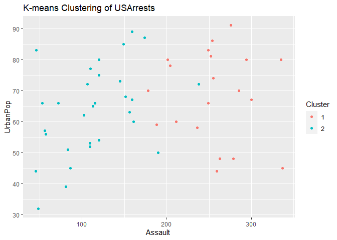

K-means clustering
================
Joshua Edefo
2024-07-27

library

``` r
library(tidyverse)
```

    ## Warning: package 'tidyverse' was built under R version 4.3.2

    ## Warning: package 'ggplot2' was built under R version 4.3.2

    ## Warning: package 'forcats' was built under R version 4.3.2

    ## Warning: package 'lubridate' was built under R version 4.3.3

    ## ── Attaching core tidyverse packages ──────────────────────── tidyverse 2.0.0 ──
    ## ✔ dplyr     1.1.3     ✔ readr     2.1.4
    ## ✔ forcats   1.0.0     ✔ stringr   1.5.0
    ## ✔ ggplot2   3.4.4     ✔ tibble    3.2.1
    ## ✔ lubridate 1.9.3     ✔ tidyr     1.3.0
    ## ✔ purrr     1.0.2     
    ## ── Conflicts ────────────────────────────────────────── tidyverse_conflicts() ──
    ## ✖ dplyr::filter() masks stats::filter()
    ## ✖ dplyr::lag()    masks stats::lag()
    ## ℹ Use the conflicted package (<http://conflicted.r-lib.org/>) to force all conflicts to become errors

Load the Iris dataset

``` r
data(USArrests)
head (USArrests)
```

    ##            Murder Assault UrbanPop Rape
    ## Alabama      13.2     236       58 21.2
    ## Alaska       10.0     263       48 44.5
    ## Arizona       8.1     294       80 31.0
    ## Arkansas      8.8     190       50 19.5
    ## California    9.0     276       91 40.6
    ## Colorado      7.9     204       78 38.7

``` r
str (USArrests)
```

    ## 'data.frame':    50 obs. of  4 variables:
    ##  $ Murder  : num  13.2 10 8.1 8.8 9 7.9 3.3 5.9 15.4 17.4 ...
    ##  $ Assault : int  236 263 294 190 276 204 110 238 335 211 ...
    ##  $ UrbanPop: int  58 48 80 50 91 78 77 72 80 60 ...
    ##  $ Rape    : num  21.2 44.5 31 19.5 40.6 38.7 11.1 15.8 31.9 25.8 ...

put in data frame

``` r
df <- data.frame (USArrests)
```

Remove rows with missing values & Scale each variable

``` r
df <- na.omit(df)

df <- scale(df)
```

Methods of finding k

Elbow Plot: Next, create a plot of the number of clusters vs. the total
within sum of squares (WCSS).

The WCSS measures the variability within each cluster. We’ll use the
fviz_nbclust() function from the factoextra package

``` r
library(cluster)
library(factoextra)
```

    ## Warning: package 'factoextra' was built under R version 4.3.3

    ## Welcome! Want to learn more? See two factoextra-related books at https://goo.gl/ve3WBa

Create plot of number of clusters vs. WCSS \# elbow method

``` r
fviz_nbclust(df, kmeans, method = "wss")
```

<!-- -->

``` r
# the optimal value is 4
```

Create plot of number of clusters vs. silhouette \# silhuoette method

``` r
fviz_nbclust(df, kmeans, method = "silhouette")
```

<!-- -->

``` r
# the optimal value is 2
```

Create plot of number of clusters vs. gap_stat \# gap_stat method

``` r
fviz_nbclust(df, kmeans, method = "gap_stat")
```

<!-- -->

``` r
# the optimal value is 2
```

K- means Clustering when k = 4

``` r
# Specify the number of clusters (k)
k <- 2
# Perform k-means clustering
kmeans_result <- kmeans(df, centers = k, nstart = 25)
kmeans_result
```

    ## K-means clustering with 2 clusters of sizes 30, 20
    ## 
    ## Cluster means:
    ##      Murder    Assault   UrbanPop       Rape
    ## 1 -0.669956 -0.6758849 -0.1317235 -0.5646433
    ## 2  1.004934  1.0138274  0.1975853  0.8469650
    ## 
    ## Clustering vector:
    ##        Alabama         Alaska        Arizona       Arkansas     California 
    ##              2              2              2              1              2 
    ##       Colorado    Connecticut       Delaware        Florida        Georgia 
    ##              2              1              1              2              2 
    ##         Hawaii          Idaho       Illinois        Indiana           Iowa 
    ##              1              1              2              1              1 
    ##         Kansas       Kentucky      Louisiana          Maine       Maryland 
    ##              1              1              2              1              2 
    ##  Massachusetts       Michigan      Minnesota    Mississippi       Missouri 
    ##              1              2              1              2              2 
    ##        Montana       Nebraska         Nevada  New Hampshire     New Jersey 
    ##              1              1              2              1              1 
    ##     New Mexico       New York North Carolina   North Dakota           Ohio 
    ##              2              2              2              1              1 
    ##       Oklahoma         Oregon   Pennsylvania   Rhode Island South Carolina 
    ##              1              1              1              1              2 
    ##   South Dakota      Tennessee          Texas           Utah        Vermont 
    ##              1              2              2              1              1 
    ##       Virginia     Washington  West Virginia      Wisconsin        Wyoming 
    ##              1              1              1              1              1 
    ## 
    ## Within cluster sum of squares by cluster:
    ## [1] 56.11445 46.74796
    ##  (between_SS / total_SS =  47.5 %)
    ## 
    ## Available components:
    ## 
    ## [1] "cluster"      "centers"      "totss"        "withinss"     "tot.withinss"
    ## [6] "betweenss"    "size"         "iter"         "ifault"

K- means Clustering when k = 2

``` r
# Specify the number of clusters (k)
k <- 2
# Perform k-means clustering
kmeans_result <- kmeans(df, centers = k, nstart = 25)
kmeans_result
```

    ## K-means clustering with 2 clusters of sizes 20, 30
    ## 
    ## Cluster means:
    ##      Murder    Assault   UrbanPop       Rape
    ## 1  1.004934  1.0138274  0.1975853  0.8469650
    ## 2 -0.669956 -0.6758849 -0.1317235 -0.5646433
    ## 
    ## Clustering vector:
    ##        Alabama         Alaska        Arizona       Arkansas     California 
    ##              1              1              1              2              1 
    ##       Colorado    Connecticut       Delaware        Florida        Georgia 
    ##              1              2              2              1              1 
    ##         Hawaii          Idaho       Illinois        Indiana           Iowa 
    ##              2              2              1              2              2 
    ##         Kansas       Kentucky      Louisiana          Maine       Maryland 
    ##              2              2              1              2              1 
    ##  Massachusetts       Michigan      Minnesota    Mississippi       Missouri 
    ##              2              1              2              1              1 
    ##        Montana       Nebraska         Nevada  New Hampshire     New Jersey 
    ##              2              2              1              2              2 
    ##     New Mexico       New York North Carolina   North Dakota           Ohio 
    ##              1              1              1              2              2 
    ##       Oklahoma         Oregon   Pennsylvania   Rhode Island South Carolina 
    ##              2              2              2              2              1 
    ##   South Dakota      Tennessee          Texas           Utah        Vermont 
    ##              2              1              1              2              2 
    ##       Virginia     Washington  West Virginia      Wisconsin        Wyoming 
    ##              2              2              2              2              2 
    ## 
    ## Within cluster sum of squares by cluster:
    ## [1] 46.74796 56.11445
    ##  (between_SS / total_SS =  47.5 %)
    ## 
    ## Available components:
    ## 
    ## [1] "cluster"      "centers"      "totss"        "withinss"     "tot.withinss"
    ## [6] "betweenss"    "size"         "iter"         "ifault"

Add the cluster assignments to the original dataset

``` r
USArrests$Cluster <- as.factor(kmeans_result$cluster)
USArrests$Cluster
```

    ##  [1] 1 1 1 2 1 1 2 2 1 1 2 2 1 2 2 2 2 1 2 1 2 1 2 1 1 2 2 1 2 2 1 1 1 2 2 2 2 2
    ## [39] 2 1 2 1 1 2 2 2 2 2 2 2
    ## Levels: 1 2

Visualize the clusters

``` r
library(ggplot2)

ggplot(USArrests, aes(x = Assault , y = UrbanPop, color = Cluster)) +
  geom_point() +
  labs(title = "K-means Clustering of USArrests", x = "Assault ", y = "UrbanPop")
```

<!-- -->

session information

``` r
sessionInfo()
```

    ## R version 4.3.1 (2023-06-16 ucrt)
    ## Platform: x86_64-w64-mingw32/x64 (64-bit)
    ## Running under: Windows 11 x64 (build 22631)
    ## 
    ## Matrix products: default
    ## 
    ## 
    ## locale:
    ## [1] LC_COLLATE=English_United Kingdom.utf8 
    ## [2] LC_CTYPE=English_United Kingdom.utf8   
    ## [3] LC_MONETARY=English_United Kingdom.utf8
    ## [4] LC_NUMERIC=C                           
    ## [5] LC_TIME=English_United Kingdom.utf8    
    ## 
    ## time zone: Europe/London
    ## tzcode source: internal
    ## 
    ## attached base packages:
    ## [1] stats     graphics  grDevices utils     datasets  methods   base     
    ## 
    ## other attached packages:
    ##  [1] factoextra_1.0.7 cluster_2.1.4    lubridate_1.9.3  forcats_1.0.0   
    ##  [5] stringr_1.5.0    dplyr_1.1.3      purrr_1.0.2      readr_2.1.4     
    ##  [9] tidyr_1.3.0      tibble_3.2.1     ggplot2_3.4.4    tidyverse_2.0.0 
    ## 
    ## loaded via a namespace (and not attached):
    ##  [1] utf8_1.2.3        generics_0.1.3    rstatix_0.7.2     stringi_1.7.12   
    ##  [5] hms_1.1.3         digest_0.6.33     magrittr_2.0.3    evaluate_0.21    
    ##  [9] grid_4.3.1        timechange_0.2.0  fastmap_1.1.1     ggrepel_0.9.5    
    ## [13] backports_1.4.1   fansi_1.0.4       scales_1.3.0      abind_1.4-5      
    ## [17] cli_3.6.1         rlang_1.1.1       munsell_0.5.0     withr_2.5.0      
    ## [21] yaml_2.3.7        tools_4.3.1       tzdb_0.4.0        ggsignif_0.6.4   
    ## [25] colorspace_2.1-0  ggpubr_0.6.0      broom_1.0.5       vctrs_0.6.3      
    ## [29] R6_2.5.1          lifecycle_1.0.3   car_3.1-2         pkgconfig_2.0.3  
    ## [33] pillar_1.9.0      gtable_0.3.4      glue_1.6.2        Rcpp_1.0.11      
    ## [37] xfun_0.40         tidyselect_1.2.0  rstudioapi_0.15.0 knitr_1.44       
    ## [41] farver_2.1.1      htmltools_0.5.6   labeling_0.4.3    carData_3.0-5    
    ## [45] rmarkdown_2.25    compiler_4.3.1
